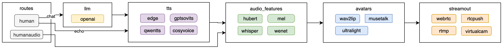

<p align="center">
    
</p>

<p align="center">
    <a href="./LICENSE"></a>
    <a href=""></a>
    <a href=""></a>
    <a href=""></a>
</p>

# LiveTalking 昇腾 910B 适配版

> 本项目基于 [LiveTalking](https://github.com/lipku/LiveTalking) 进行 **华为昇腾 910B（NPU）** 适配，目标是在国产 AI 算力上实现低延迟、可商用的实时流式数字人推理。

## 适配进展

| 模型 | 昇腾 910B 状态 | 性能 |
|:------|:--------------|:-----|
| **wav2lip / wav2lip256** | ✅ 已适配 | 接近实时（~50 FPS） |
| musetalk | 🚧 待适配 | — |
| ultralight | 🚧 待适配 | — |
| ernerf | 🚧 待适配 | — |

当前**已完成 wav2lip 在昇腾 910B 上的端到端适配与验证**，口型推理帧率与推流帧率均能达到实时要求。后续会逐步完成 musetalk、ultralight 等模型的 NPU 迁移。

**效果演示**: [wav2lip](https://www.bilibili.com/video/BV1scwBeyELA/) | [ernerf](https://www.bilibili.com/video/BV1G1421z73r/) | [musetalk](https://www.bilibili.com/video/BV1bUwezvEnG/)

---

## Features

1. **昇腾 910B 原生支持**：模型加载、推理、张量搬运已适配 NPU，`--device npu` 即可运行
2. 支持 wav2lip 数字人口型同步，接近实时效果
3. 支持文本/音频驱动、LLM 对话、TTS 语音合成
4. 支持 WebRTC、RTMP、虚拟摄像头输出
5. 支持数字人说话被打断、动作编排、全身视频拼接
6. 支持多并发会话与自定义数字人形象
7. 提供前端页面与 HTTP API 接口

---

## 使用场景

| 场景 | 说明 |
|------|------|
| **虚拟主播/直播带货** | 24 小时无人直播，LLM 自动生成话术 |
| **AI 数字人客服** | 接入企业知识库，用户语音提问，数字人实时回答，支持打断重说 |
| **在线教育/培训** | 教师数字分身录制课程，或通过 API 实时授课 |
| **智能语音助手** | 调用 `/human` 接口驱动数字人进行语音对话 |
| **大屏讲解** | 展厅、活动现场数字人讲解员 |
| **短视频批量制作** | 通过 `/human` + `/record` 批量生成数字人出镜视频 |

**核心流程**：用户输入文字/音频 → LLM 生成回复（可选）→ TTS 合成语音 → 数字人实时口型同步 → 音视频推流输出

---

## 1. 环境准备

> **注意**：仓库根目录的 `Dockerfile` 目前仍是旧版 CUDA 构建脚本，尚未更新为昇腾版本，**不推荐直接使用**。当前推荐以下两种部署方式：
> - **方式一**：在昇腾宿主机/虚拟机中手动部署（推荐）
> - **方式二**：使用华为官方 `ascend-pytorch` 容器，挂载代码与驱动后运行

### 1.1 昇腾 910B 环境（推荐）

#### 方式 A：昇腾容器部署

使用华为昇腾容器镜像（已内置 CANN 和 `torch_npu`）：

```bash
docker run -itd --privileged --net=host --ipc=host --name=ascend-livetalking \
  --device=/dev/davinci7 \
  --device=/dev/davinci_manager \
  --device=/dev/devmm_svm \
  --device=/dev/hisi_hdc \
  -v /usr/local/dcmi:/usr/local/dcmi:ro \
  -v /usr/local/bin/npu-smi:/usr/local/bin/npu-smi:ro \
  -v /usr/local/Ascend/driver/:/usr/local/Ascend/driver:ro \
  -v /usr/local/sbin/:/usr/local/sbin:ro \
  -v /data/LiveTalking:/data/LiveTalking \
  -p 8188:8188 \
  swr.cn-south-1.myhuaweicloud.com/ascendhub/ascend-pytorch:24.0.0-A2-2.1.0-ubuntu20.04 \
  /bin/bash
```

进入容器后安装依赖：

```bash
docker exec -it ascend-livetalking bash
cd /data/LiveTalking
source /usr/local/Ascend/ascend-toolkit/set_env.sh
pip install -r requirements.txt
# 该容器自带 PyTorch 2.1.0，与 NumPy 2.x 及新版 transformers 不兼容
pip install numpy==1.26.4 transformers==4.35.2
```

#### 方式 B：昇腾宿主机手动部署

1. 确认已安装 CANN 驱动与 toolkit，并 source 环境变量：
   ```bash
   source /usr/local/Ascend/ascend-toolkit/set_env.sh
   ```
2. 创建 Python 环境并安装依赖：
   ```bash
   conda create -n livetalking python=3.10
   conda activate livetalking
   pip install -r requirements.txt
   pip install numpy==1.26.4 transformers==4.35.2
   ```
   > 不要安装 CUDA 版 PyTorch，应由 CANN 环境提供 `torch_npu`。

### 1.2 CUDA / x86 环境（兼容原版）

若你想在 NVIDIA GPU 上运行原版功能，可继续按以下方式安装：

```bash
git clone https://github.com/lipku/LiveTalking.git
conda create -n livetalking python=3.12
conda activate livetalking
pip install torch==2.9.1 torchvision==0.24.1 torchaudio==2.9.1 --index-url https://download.pytorch.org/whl/cu128
cd LiveTalking
pip install -r requirements.txt
```

---

## 2. 快速开始

### 2.1 下载模型

| 网盘 | 地址 |
|------|------|
| 夸克云盘 | <https://pan.quark.cn/s/83a750323ef0> |
| Google Drive | <https://drive.google.com/drive/folders/1FOC_MD6wdogyyX_7V1d4NDIO7P9NlSAJ?usp=sharing> |

1. 将 `wav2lip256.pth` 拷贝到项目的 `models/` 目录下，重命名为 `wav2lip.pth`
2. 将 `wav2lip256_avatar1.tar.gz` 解压后整个文件夹拷贝到 `data/avatars/` 目录下

### 2.2 启动服务

**昇腾 910B 启动**：

```bash
source /usr/local/Ascend/ascend-toolkit/set_env.sh
python app.py --transport webrtc --model wav2lip --avatar_id wav2lip256_avatar1 --device npu
```

**CUDA / 自动设备启动**：

```bash
python app.py --transport webrtc --model wav2lip --avatar_id wav2lip256_avatar1
```

> **注意**: 服务端需开放端口 TCP:8010, UDP:1-65536

### 2.3 客户端接入

| 方式 | 说明 |
|------|------|
| 浏览器 | 打开 `http://serverip:8010/index.html`，点击“开始连接”播放数字人视频，在文本框输入文字提交即可 |
| API 调用 | 参考 [API 文档](docs/api.md) 通过 HTTP 接口驱动 |
| 桌面客户端 | 下载地址: <https://pan.quark.cn/s/d7192d8ac19b> |

### 2.4 Web 页面

| 页面 | 地址 | 说明 |
|------|------|------|
| 首页 | `/index.html` | WebRTC 连接 + 文本/音频驱动 + 录制控制 |
| Avatar 生成 | `/avatar.html` | 上传视频自动生成数字人形象 |
| 管理后台 | `/admin.html` | 实时监控会话状态与全局配置 |


### 2.5 使用说明

完整文档：<https://doc.livetalking.ai>

---

## 3. 系统架构

### 数据流图



### 各层说明

**API 层**
- `/human`: 接收文本，支持 echo（直接复读）和 chat（LLM 对话）模式
- `/humanaudio`: 接收音频文件直接播放
- 每个连接分配唯一 `sessionid`，支持多用户并发

**逻辑层**
- **LLM 引擎**: 对接 Qwen 等大模型生成对话回复
- **TTS 引擎**: 模块化设计，支持 EdgeTTS、GPT-SoVITS、CosyVoice、腾讯云等多种方案
- **特征提取**: 同步提取音频的声学特征（如 Mel 频谱），用于口型推理

**渲染层**
- **模型推理**: 使用深度学习模型（Wav2Lip 等）根据音频特征生成口型画面
- **后处理**: 将生成的口型区域平滑贴回原始高清视频

**推流层**
- **WebRTC**: 低延迟浏览器端推流
- **RTMP**: 标准直播协议，支持推流到 B站/YouTube 等平台
- **虚拟摄像头**: 输出为系统摄像头设备

**插件系统**
- 基于 [registry.py](registry.py) 的去中心化注册机制，开发者可自行扩展 TTS、Avatar、Output 模块

---

## 4. API 接口

| 文档 | 说明 |
|------|------|
| [docs/api.md](docs/api.md) | 通用业务 API — WebRTC、文本/音频驱动、录制、动作编排 |
| [docs/avatar_api.md](docs/avatar_api.md) | Avatar 生成 API — 创建任务、查询进度、删除任务 |
| [docs/admin_api.md](docs/admin_api.md) | Admin 管理 API — 全局配置、会话监控、强制停止 |

---

## 5. Docker 说明

> ⚠️ 仓库中的 `Dockerfile` 为旧版 CUDA 构建脚本，尚未针对昇腾 910B 更新，**请勿直接用于昇腾部署**。昇腾环境推荐使用第 1 节中的官方 `ascend-pytorch` 容器或手动部署。
>
> 后续会补充一份面向昇腾的 Dockerfile，敬请关注。

---

## 6. 性能指标

- 每路视频压缩消耗 CPU，分辨率越高 CPU 消耗越大；每路口型推理消耗 NPU/GPU
- 不说话时并发数取决于 CPU，同时说话并发数取决于 NPU/GPU
- 后端日志 `inferfps` = 推理帧率，`finalfps` = 最终推流帧率，两者均需 >=25 才算实时

### 实时推理性能

| 模型 | 硬件 | FPS |
|:------|:------|:----|
| wav2lip256 | RTX 3060 | 60 |
| wav2lip256 | RTX 3080Ti | 120 |
| **wav2lip256** | **昇腾 910B** | **~50** |
| musetalk | RTX 3080Ti | 42 |
| musetalk | RTX 3090 | 45 |
| musetalk | RTX 4090 | 72 |

- **wav2lip256 推荐配置**：RTX 3060 及以上，或 **昇腾 910B + `--device npu`**
- musetalk 推荐 RTX 3080Ti 及以上
- 昇腾 910B 当前已完成 wav2lip 适配，musetalk / ultralight 适配中


